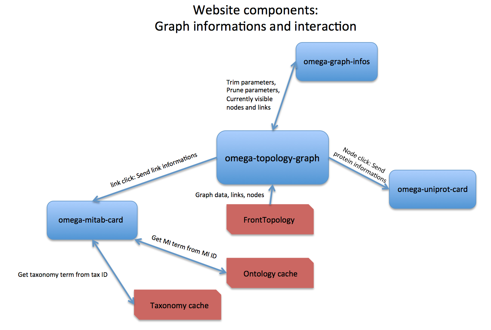
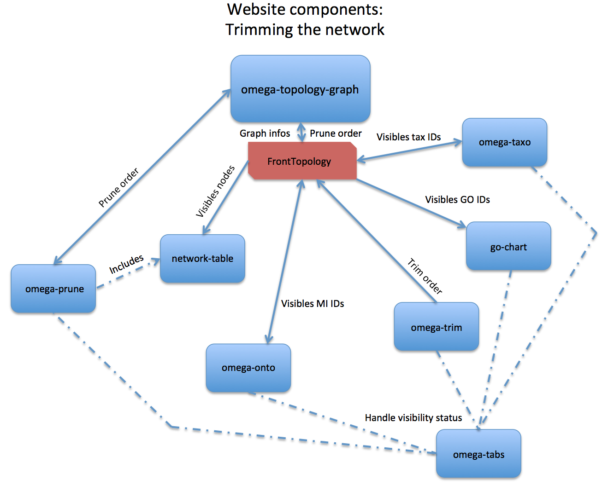

![Built With Stencil](https://img.shields.io/badge/-Built%20With%20Stencil-16161d.svg?logo=data%3Aimage%2Fsvg%2Bxml%3Bbase64%2CPD94bWwgdmVyc2lvbj0iMS4wIiBlbmNvZGluZz0idXRmLTgiPz4KPCEtLSBHZW5lcmF0b3I6IEFkb2JlIElsbHVzdHJhdG9yIDE5LjIuMSwgU1ZHIEV4cG9ydCBQbHVnLUluIC4gU1ZHIFZlcnNpb246IDYuMDAgQnVpbGQgMCkgIC0tPgo8c3ZnIHZlcnNpb249IjEuMSIgaWQ9IkxheWVyXzEiIHhtbG5zPSJodHRwOi8vd3d3LnczLm9yZy8yMDAwL3N2ZyIgeG1sbnM6eGxpbms9Imh0dHA6Ly93d3cudzMub3JnLzE5OTkveGxpbmsiIHg9IjBweCIgeT0iMHB4IgoJIHZpZXdCb3g9IjAgMCA1MTIgNTEyIiBzdHlsZT0iZW5hYmxlLWJhY2tncm91bmQ6bmV3IDAgMCA1MTIgNTEyOyIgeG1sOnNwYWNlPSJwcmVzZXJ2ZSI%2BCjxzdHlsZSB0eXBlPSJ0ZXh0L2NzcyI%2BCgkuc3Qwe2ZpbGw6I0ZGRkZGRjt9Cjwvc3R5bGU%2BCjxwYXRoIGNsYXNzPSJzdDAiIGQ9Ik00MjQuNywzNzMuOWMwLDM3LjYtNTUuMSw2OC42LTkyLjcsNjguNkgxODAuNGMtMzcuOSwwLTkyLjctMzAuNy05Mi43LTY4LjZ2LTMuNmgzMzYuOVYzNzMuOXoiLz4KPHBhdGggY2xhc3M9InN0MCIgZD0iTTQyNC43LDI5Mi4xSDE4MC40Yy0zNy42LDAtOTIuNy0zMS05Mi43LTY4LjZ2LTMuNkgzMzJjMzcuNiwwLDkyLjcsMzEsOTIuNyw2OC42VjI5Mi4xeiIvPgo8cGF0aCBjbGFzcz0ic3QwIiBkPSJNNDI0LjcsMTQxLjdIODcuN3YtMy42YzAtMzcuNiw1NC44LTY4LjYsOTIuNy02OC42SDMzMmMzNy45LDAsOTIuNywzMC43LDkyLjcsNjguNlYxNDEuN3oiLz4KPC9zdmc%2BCg%3D%3D&colorA=16161d&style=flat-square)

# Interolog network visualiser

> Show a interolog network, provide many ways to interact with and tools to save and reload a graph.

This projet uses `Stencil`. Report to the Stencil's documentation to see details about the components API.

## Needed micro-services
Before we can get started, you must have a bunch of micro-services running in the webserver.

- CouchDB database
- `omegalomodb`, the request agregator
- `omega-topology-service`, the skeleton builder
- `omega-topology-mitab-service`, the MI Tab lines getter
- `omega-topology-uniprot`, the UniProt data fetcher
- `omega-topology-MIontology`, the MI IDs resolver
- `omega-topology-taxonomy`, the tax IDs resolver

To configure the services, read their own documentation.

They should be on the same server that the webserver is. If you keep the default ports, ports should be correclty configured in `src/utils.ts`. Change them if needed.

## Getting Started

Clone the repository, install packages:

```bash
git clone https://github.com/alkihis/omega-topology.git
cd omega-topology
npm i
```

and run:

```bash
npm start
```

To build the website for production, run:

```bash
npm run build
```

Its output will be in the `www` folder.

## Project structure

### Components architechture

Components are organized by function: Generally, one component is one function, except the organizer `omega-graph`.

Hard-linked to project components are in the component folder of this project. Other imported components are declared in `index.ts` file.

Here's a quick review of all components:
- `omega-download` can present a modal to the user in order to download the graph.
- `omega-reset` helps the user to reset current graph.
- `omega-reheat` helps the user to reheat current graph.
- `omega-import` is a modal used to load a user file as graph.
- `omega-search` can search proteins in graph by annotation.
- `omega-graph-infos` show short text lines about the current trimming parameters applyied.
- `omega-artefact` is a tool to import custom user-defined interactions in the network.
- `omega-prune` can select nodes in order to build a sub-graph containing all the connex components of a node.
- `omega-trim` is a tool to select when the program will consider two proteins homologous.
- `omega-taxo` is a taxonomic tree used to select which taxons the user wants to see.
- `omega-onto` is a experimental detection methods tree used to select which one the user wants to see.
- `omega-tabs` is used to show or hide trimming components.
- `omega-mitab-card` is a card showing graph link data.
- `omega-uniprot-card` is a card showing the UniProt data summary to the user after a node click.
- And, the most important, `omega-graph` show the graph and organize events sended by other components.


Component data heavly rely on the interolog network data (interaction data, provided by `PSQData` instances, and homology data, provided by `HoParameterSet` instances).

Access to those datas are provided by the `FrontTopology` object.
This object is a singleton (instanciated only once) and helps the developer to access `OmegaTopology` data, and provide a supplementary syntaxic sugar to use its methods.

Take a look of `FrontTopology` available methods & properties in the [Front Topology](#fronttopology-the-organizer) section.


#### Overview of all components


#### Informations components




#### Components used to trim the network




#### Widgets & Quick actions


### FrontTopology, the organizer

This object is a singleton (instanciated only once) and helps the developer to access `OmegaTopology` data, and provide a supplementary syntaxic sugar to use its methods.

#### Why FrontTopology ?

Because everything in the Front-End development must be asynchronous.

For example, in this project, we need to first load the graph skeleton, show it immediately, then download GO Terms, UniProt data and finally download MI Tab data, to have access to interactions details.

Graph skeleton will be downloaded from `omega-topology-service` micro-service.

Even if `OmegaTopology` expose helpful methods in order to do those tasks, it don't have organized pipeline to do it in a specific order. `FrontTopology` provide methods to automatically download missing data, bind it accross differents objects and update components with a event-driven message system.

#### FrontTopology initialization pipeline

First, after instanciation, the graph component `omega-graph` initializate `FrontTopology` with the `.init(specie: string)` method.

`FrontTopology` create a new `OmegaTopology` object, download the appropriate skeleton, download GO Terms, setup GO Chart, download UniProt data, setup the network table, and return the completion of all of that in a Promise.

Once the Promise is successful, you can start the MI Tab download with `.downloadMitabLines()` (it also returns a Promise).

All your data is ready !

If you want to change the specie, just call `.resetInstance()` then call `.init(specie)` again, with the specie of your choice (you will need to re-download MI Tab lines).

If you have a deal with any of the `OmegaTopology` methods, use the `.topo` accessor in `FrontTopology` to access it.
But, before directly use the base object, we'll take a look of `FrontTopology` available properties & methods:

#### Properties

- `.topo`: Access to the `OmegaTopology` internal object.
- `.psi`: Access to the `PSICQuic` internal object.
- `.mitab_percentage`: Access to current MI Tab download percentage.
- `.full_ready_promise`: Promise resolved when the OmegaTopology is fully initialized.
- `.taxo_ids`: Get the visible taxonomic IDs in the graph.
- `.onto_ids`: Get the visible experimetental detection methods in the graph.
- `.mitab_loaded`: True if MI Tab data is loaded.
- `.current_trim_parameters` and `.current_prune_parameters`: Get the currently applied trimming & pruning parameters.
  
#### Methods

- `downloadUniprotData()`: Download the needed UniProt data and setup GO chart + network table automatically.
- `showGraph()`: Trigger a graph update in order to make `omega-graph` show the currently visible nodes in the internal interolog network.
- `trim(options: TrimOptions)`: Trim the current network and trigger a graph update.
- `prune(seeds, distance)`: Compute the connex components of a specific nodes, or make visible only the N nearest nodes of a seeds.


#### Events
`FrontTopology` emits diverse event, during the phase of download/initialization. All events are dispatched to `window`.

- `FrontTopology.go-terms-downloaded` is emitted to say when the go terms are downloaded.
- `FrontTopology.go-terms-download-error` is emitted when the GO term download has failed.
- `FrontTopology.uniprot-downloaded` is emitted to say when the UniProt data is downloaded.
- `FrontTopology.uniprot-download-error` is emitted when the UniProt data download has failed.
- `FrontTopology.mitab-download-update` contains in the `detail` property the current MI Tab percentage of download. If the percentage is `null`, an error occured.
- `FrontTopology.mitab-downloaded` is emitted when all the MI Tab lines are downloaded.

### omega-graph, the main component

`omega-graph` component (also called `omega-topology-graph`) is a big organizer of what's happening in the website.

It is in charge to initiate `FrontTopology` during its `.load()` method with the user desired specie.

Also, `omega-graph` removes the preloader when the website is loaded, and show error messages if graph download / UniProt download can't be made.

If you have events made to refresh the graph, highlight nodes or select them, you have to deal with `omega-graph` component. Check its API in its dedicated [README](src/components/omega-graph/readme.md) ! 

## Usage

### On start


### When started


## Adding new components

### Naming components

All the new added component inside the project must respect the naming convention: **omega-&lt;function&gt;**.

If you want to build a component inside the project that fetch Intact data, call it omega-intact !


### Interact with the other components

Component communication is build with the `Stencil`'s "event system". This isn't properly a full event system, and relies to the classic `addEventListener` of the good old JavaScript.

But, inside a component (class with `@Component` decorator), `Stencil` provide two decorators that helps binding listeners and emit various events.

#### `@Event` decorator
The `@Event` declares a new `EventEmitter`, a variable able to emit event. **ALWAYS** configure your event with a custom event, do **NOT** use default name ! Event naming convention is `<component-name>.<event-function>`. Use the `-` to seperate words, all letters should be in lower case.

For example, to define a `EventEmitter` that is called when a Intact download is finish, you can use this sample: 

```ts
@Event({ 
    eventName: 'omega-intact.intact-downloaded' 
}) intactDownloaded: EventEmitter<void>;
```

#### `@Listen` decorator

To listen for other component events, you should use the `@Listen` decorator. It bind a function that will be called when a specifc event happens.

```ts
@Listen('omega-intact.intact-downloaded', { target: 'window' }) 
// The window target listen globally. 
// By default, @Listen will capture only the events coming from the component children.
removeLoadingBar() { // This method will be called when the event happend
    // Do things...
    this.loading_bar_shown = false;
}
```

#### Interactions with FrontTopology

You can relies to `FrontTopology` in order to do some action, like trigger a graph trim or a simple update.

For other graph events, try instead to emit events and catch them in the `omega-graph` component, if the graph is directly concerned.


