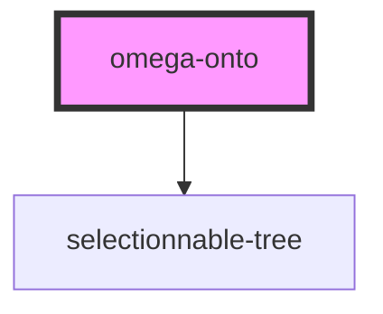

# omega-onto

<!-- Auto Generated Below -->

## Events

| Event             | Description | Type                    |
| ----------------- | ----------- | ----------------------- |
| `omega-onto.trim` |             | `CustomEvent<string[]>` |

## Methods

### `getData() => Promise<import("/Users/lberanger/omega-topology-graph/node_modules/@mmsb/selectionnable-tree/dist/types/index").TreeLike[]>`

#### Returns

Type: `Promise<TreeLike[]>`

### `setData(d: import("/Users/lberanger/omega-topology-graph/node_modules/@mmsb/selectionnable-tree/dist/types/index").SubNode) => Promise<void>`

#### Returns

Type: `Promise<void>`

### `unsetData() => Promise<void>`

#### Returns

Type: `Promise<void>`

## Dependencies

### Depends on

- selectionnable-tree

### Graph

----------------------------------------------

*Built with [StencilJS](https://stenciljs.com/)*
