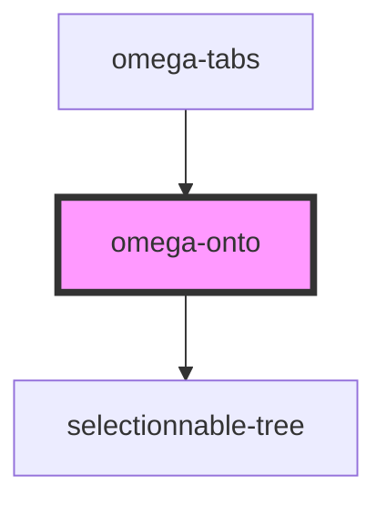

# omega-onto

<!-- Auto Generated Below -->

## Events

| Event             | Description | Type                    |
| ----------------- | ----------- | ----------------------- |
| `omega-onto.trim` |             | `CustomEvent<string[]>` |

## Methods

### `getData() => Promise<TreeLike[]>`

#### Returns

Type: `Promise<TreeLike[]>`

### `setData(d: SubNode) => Promise<void>`

#### Returns

Type: `Promise<void>`

### `unsetData() => Promise<void>`

#### Returns

Type: `Promise<void>`

## Dependencies

### Used by

 - [omega-tabs](../omega-tabs)

### Depends on

- selectionnable-tree

### Graph

----------------------------------------------

*Built with [StencilJS](https://stenciljs.com/)*
