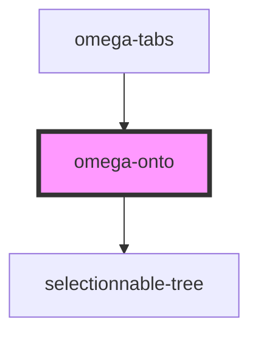

# omega-onto

## What's this ?

This component is a ontology term selector.

It encapsulate a `selectionnable-tree`, a tree where each node a selectable.

Once MI Tab data are loaded, the corresponding tree for all the experimental detection methods (MI IDs) is asked to `omega-topology-MIontology`, which returns a `SubNode` object. The object is computed and defined as data for the tree.

User can select the experimental detection methods he wants to see, and click `Select methods` to trim every link that don't have a interaction support having one of the selected methods.

If the user want to go back, a click to `Reset methods` will cancel every ontology filter.

Unselect all the nodes is equivalent to reset the methods with the appropriate button.

Tree will reload at each trim or graph refresh, because the experimental detection methods may have changed.

Some methods are available to manipulate the tree data, check it out in the [Methods](#methods) section !

<!-- Auto Generated Below -->

## Events

| Event             | Description                                   | Type                    |
| ----------------- | --------------------------------------------- | ----------------------- |
| `omega-onto.trim` | Fires when a trim by ontology terms is asked. | `CustomEvent<string[]>` |

## Methods

### `getData() => Promise<TreeLike[]>`

Get the actual loaded data in the tree instance.

#### Returns

Type: `Promise<TreeLike[]>`

### `selectedNumber(bottom_only?: boolean) => Promise<number>`

Get the number of selected nodes.

#### Returns

Type: `Promise<number>`

### `setData(d: SubNode) => Promise<void>`

Register new data inside the tree, via a API response (SubNode).

#### Returns

Type: `Promise<void>`

### `unsetData() => Promise<void>`

Unset currently loaded data.

#### Returns

Type: `Promise<void>`

## Dependencies

### Used by

 - [omega-tabs](../omega-tabs)

### Depends on

- selectionnable-tree

### Graph

----------------------------------------------

*Built with [StencilJS](https://stenciljs.com/)*
