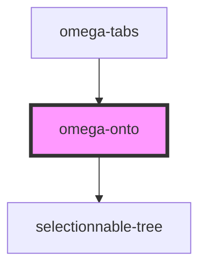

# omega-onto

<!-- Auto Generated Below -->

## Events

| Event             | Description                                   | Type                    |
| ----------------- | --------------------------------------------- | ----------------------- |
| `omega-onto.trim` | Fires when a trim by ontology terms is asked. | `CustomEvent<string[]>` |

## Methods

### `getData() => Promise<TreeLike[]>`

Get the actual loaded data in the tree instance.

#### Returns

Type: `Promise<TreeLike[]>`

### `selectedNumber(bottom_only?: boolean) => Promise<number>`

Get the number of selected nodes.

#### Returns

Type: `Promise<number>`

### `setData(d: SubNode) => Promise<void>`

Register new data inside the tree, via a API response (SubNode).

#### Returns

Type: `Promise<void>`

### `unsetData() => Promise<void>`

Unset currently loaded data.

#### Returns

Type: `Promise<void>`

## Dependencies

### Used by

 - [omega-tabs](../omega-tabs)

### Depends on

- selectionnable-tree

### Graph

----------------------------------------------

*Built with [StencilJS](https://stenciljs.com/)*
