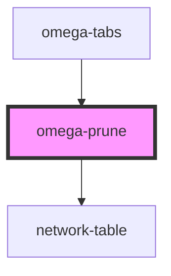

# my-component

<!-- Auto Generated Below -->

## Events

| Event                    | Description | Type                |
| ------------------------ | ----------- | ------------------- |
| `prune-end-select-nodes` |             | `CustomEvent<void>` |
| `prune-select-nodes`     |             | `CustomEvent<void>` |

## Dependencies

### Used by

 - [omega-tabs](../omega-tabs)

### Depends on

- network-table

### Graph

----------------------------------------------

*Built with [StencilJS](https://stenciljs.com/)*
