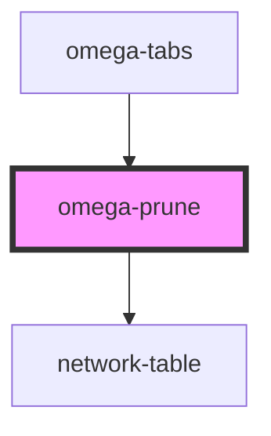

# omega-prune

## What's this ?

This component helps user to select nodes, then prune the graph (use the select nodes as seeds).

You can also select the maximum visible distance from seeds allowed.

This component also integrate a `network-table`, a table used to display short informations about presents nodes in the graph, and allow to select them directly in the table. Informations displayed are **protein accession number**, **first gene name** and **number of edges connected to the node**.

<!-- Auto Generated Below -->

## Events

| Event                       | Description                                         | Type                |
| --------------------------- | --------------------------------------------------- | ------------------- |
| `omega-prune.end-selection` | Fires when user end selection mode.                 | `CustomEvent<void>` |
| `omega-prune.selection`     | Fires when user start selection mode.               | `CustomEvent<void>` |
| `omega-prune.unselect-all`  | Fires when user ask a global unselect of all nodes. | `CustomEvent<void>` |

## Dependencies

### Used by

 - [omega-tabs](../omega-tabs)

### Depends on

- network-table

### Graph

----------------------------------------------

*Built with [StencilJS](https://stenciljs.com/)*
