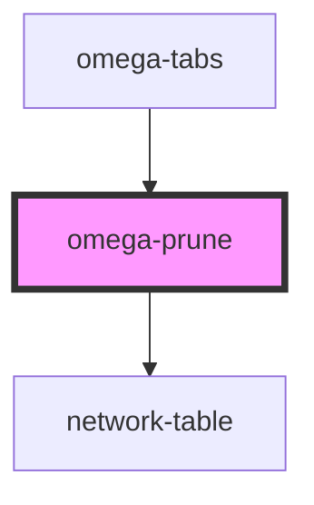

# my-component

<!-- Auto Generated Below -->

## Events

| Event                       | Description                                         | Type                |
| --------------------------- | --------------------------------------------------- | ------------------- |
| `omega-prune.end-selection` | Fires when user end selection mode.                 | `CustomEvent<void>` |
| `omega-prune.selection`     | Fires when user start selection mode.               | `CustomEvent<void>` |
| `omega-prune.unselect-all`  | Fires when user ask a global unselect of all nodes. | `CustomEvent<void>` |

## Dependencies

### Used by

 - [omega-tabs](../omega-tabs)

### Depends on

- network-table

### Graph

----------------------------------------------

*Built with [StencilJS](https://stenciljs.com/)*
