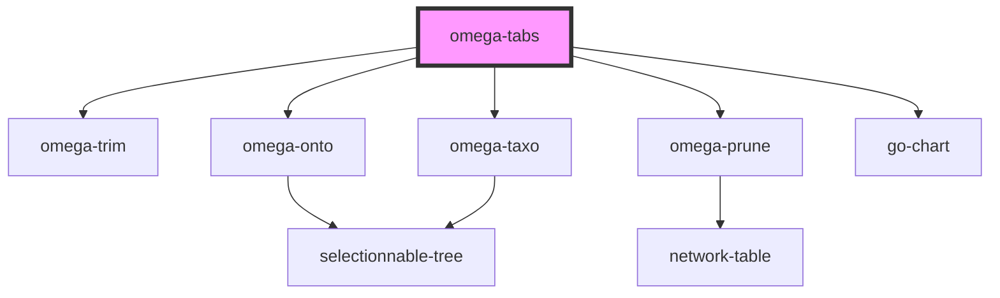

# omega-tabs

<!-- Auto Generated Below -->

## Dependencies

### Depends on

- [omega-trim](../omega-trim)
- [omega-onto](../omega-onto)
- [omega-taxo](../omega-taxo)
- [omega-prune](../omega-prune)
- go-chart

### Graph

----------------------------------------------

*Built with [StencilJS](https://stenciljs.com/)*
