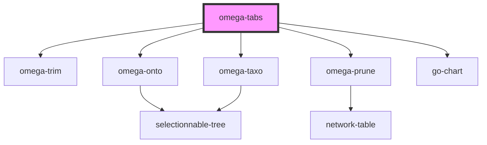

# omega-tabs

## What's this ?

This component encapsulate all the trimming components inside tabs.

Tabs will be visible at the top of the screen, and trimming components are presented in a side panel, in the top-left corner.

You can trigger a tab change programmatically with `.goToTab()`.

<!-- Auto Generated Below -->

## Methods

### `goToTab(tab: string) => Promise<void>`

Focus a specific tab.

#### Returns

Type: `Promise<void>`

## Dependencies

### Depends on

- [omega-trim](../omega-trim)
- [omega-onto](../omega-onto)
- [omega-taxo](../omega-taxo)
- [omega-prune](../omega-prune)
- go-chart

### Graph

----------------------------------------------

*Built with [StencilJS](https://stenciljs.com/)*
