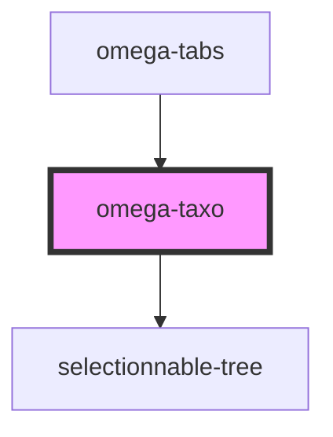

# omega-taxo

## What's this ?

This component is a taxonomy term selector.

It encapsulate a `selectionnable-tree`, a tree where each node a selectable.

Once MI Tab data are loaded, the corresponding tree for all the present taxons in graph (tax IDs) is asked to `omega-topology-taxonomy`, which returns a `SubNode` object. The object is computed and defined as data for the tree.

User can select the species/taxons he wants to see, and click `Select taxons` to trim every link that don't have a interaction support detected in one of the selected taxons.

If the user want to go back, a click to `Reset taxons` will cancel every taxonomy filter.

Unselect all the nodes is equivalent to reset the methods with the appropriate button.

Tree will reload at each trim or graph refresh, because the available taxons/specie in graph may have changed.

Some methods are available to manipulate the tree data, check it out in the [Methods](#methods) section !

<!-- Auto Generated Below -->

## Events

| Event             | Description                                 | Type                    |
| ----------------- | ------------------------------------------- | ----------------------- |
| `omega-taxo.trim` | Fires when a trim by taxonomy IDs is asked. | `CustomEvent<string[]>` |

## Methods

### `getData() => Promise<TreeLike[]>`

Get the actual loaded data in the tree instance.

#### Returns

Type: `Promise<TreeLike[]>`

### `selectedNumber(bottom?: boolean) => Promise<number>`

Get the number of selected nodes.

#### Returns

Type: `Promise<number>`

### `setData(d: SubNode) => Promise<void>`

Register new data inside the tree, via a API response (SubNode).

#### Returns

Type: `Promise<void>`

### `unsetData() => Promise<void>`

Unset currently loaded data.

#### Returns

Type: `Promise<void>`

## Dependencies

### Used by

 - [omega-tabs](../omega-tabs)

### Depends on

- selectionnable-tree

### Graph

----------------------------------------------

*Built with [StencilJS](https://stenciljs.com/)*
