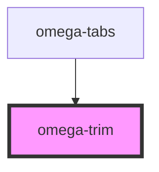

# my-component

<!-- Auto Generated Below -->

## Events

| Event                  | Description | Type                                                                                        |
| ---------------------- | ----------- | ------------------------------------------------------------------------------------------- |
| `trim-property-change` |             | `CustomEvent<{ identity: number; e_value: number; similarity: number; coverage: number; }>` |

## Dependencies

### Used by

 - [omega-tabs](../omega-tabs)

### Graph

----------------------------------------------

*Built with [StencilJS](https://stenciljs.com/)*
