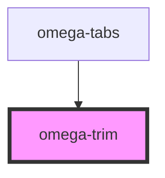

# my-component

<!-- Auto Generated Below -->

## Properties

| Property     | Attribute    | Description | Type                                                                               | Default             |
| ------------ | ------------ | ----------- | ---------------------------------------------------------------------------------- | ------------------- |
| `coverage`   | `coverage`   |             | `string`                                                                           | `undefined`         |
| `e_value`    | `e_value`    |             | `string`                                                                           | `undefined`         |
| `fix_at`     | --           |             | `{ identity?: string; coverage?: string; similarity?: string; e_value?: string; }` | `original_fixed_at` |
| `identity`   | `identity`   |             | `string`                                                                           | `undefined`         |
| `similarity` | `similarity` |             | `string`                                                                           | `undefined`         |

## Events

| Event                        | Description | Type                                                                                        |
| ---------------------------- | ----------- | ------------------------------------------------------------------------------------------- |
| `omega-trim.property-change` |             | `CustomEvent<{ identity: number; e_value: number; similarity: number; coverage: number; }>` |

## Dependencies

### Used by

 - [omega-tabs](../omega-tabs)

### Graph

----------------------------------------------

*Built with [StencilJS](https://stenciljs.com/)*
